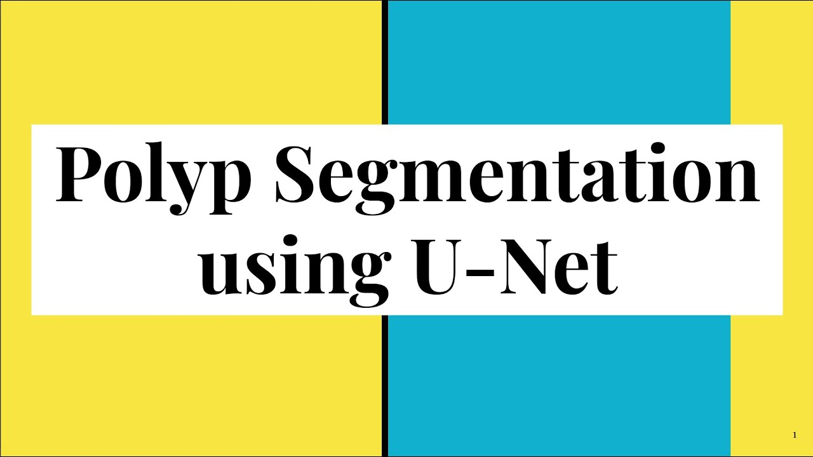

# Medical-Image-Segmentation-DL
Implemented Unet++ models for medical image segmentation to detect and classify colorectal polyps.

<!-- PROJECT LOGO -->
 

  

  <h3 align="center">Medical Image Segmentation to Detect And Classify Colorectal Polyps</h3>

<!-- TABLE OF CONTENTS -->

  
Table of Contents

    <li><a href="#Business Objective">Business Objective</a></li>
    <li><a href="#Goal">Goal</a></li>
    <li><a href="#Tech Stack">Tech Stack</a></li>
    <li><a href="#Data and Code Overview">Data and Code Overview</a></li>
    <li><a href="#Approach Steps">Approach Steps</a></li>
    <li><a href="#Project Takeaways">Project Takeaways</a></li>
  
  </ol>

## Business Objective

Machine learning and deep learning technologies are increasing at a fast pace with respect to the domain of healthcare and medical sciences. These technologies sometimes even out perform medical doctors by producing results that might not be easily notable to a human eye. Polyp recognition and segmentation is one such technology which helps doctors identify polyps from colonoscopic images

## Goal
To segment the polyps from colonoscopy images

The pdf file Solution_Methodology.pdf has the details for the complete methodology used in the project.

Star⭐ the repo if you like what you see😉.

## Tech Stack

Deep learning library used : Pytorch

Computer vision library used : OpenCV

Other python libraries :

## Data and Code Overview :

CVC-Clinic database consists of frames extracted from colonoscopy videos. The
dataset contains several examples of polyp frames & corresponding ground truth for
them.The Ground Truth image consists of a mask corresponding to the region covered by
the polyp in the image. The data is available in both .png and .tiff formats

Data Src : https://www.kaggle.com/balraj98/cvcclinicdb

This is the code overview setup of the project

[![Code overview Screen Shot][Code-overview]](https://www.linkpicture.com/q/overview.png)

## Approach Steps

1. Data Understanding : Understanding the essence of the dataset

2. Understanding evaluation metrics:Understanding the metrics that are going to be used for evaluating the predictions

3. Unet Architecture :Understanding Unet architecture and why is it preferred widely in building deep learning models with respect to medical sciences.

4. Unet ++ :Understanding Unet++ and how is it different from Unet

5. Environment Setup : Setting up a working environment for the project

6. Data Augmentation : Creating new data by making modifications on the existing data

7. Model building : Building Unet ++ model using pytorch

8. Model Training; Training the model. ( A GPU might be required since model training takes a really long time in CPUs)

9. Model Prediction
   
## Project Takeaways

1. Understanding Polyp Segmentation Problem

2. Understanding IOU

3. Understanding Data augmentation

4. Data augmentation using pytorch

5. Understanding Computer vision and its applications in medical field

6. Understanding and implementing CNN models

7. OpenCV for computer vision

8. Understanding VGG,Unet and Unet++ architectures

9. Building VGG block using Pytorch

10. Building Unet++ network using Pytorch

11.Training and predicting Unet++ models
    

[Code-overview]: images/overview.png
